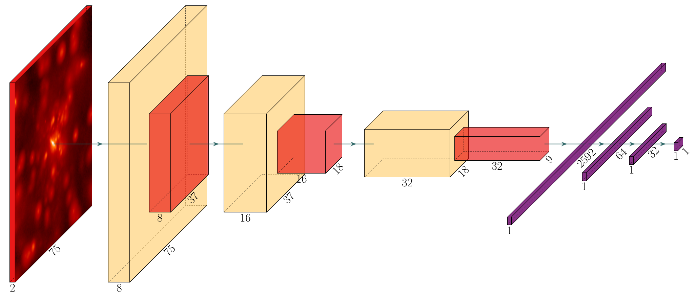
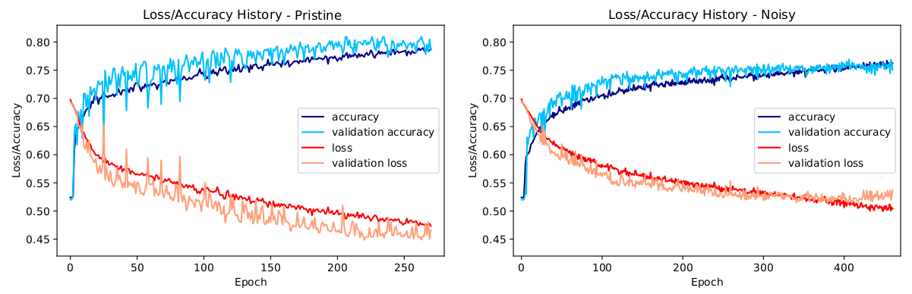
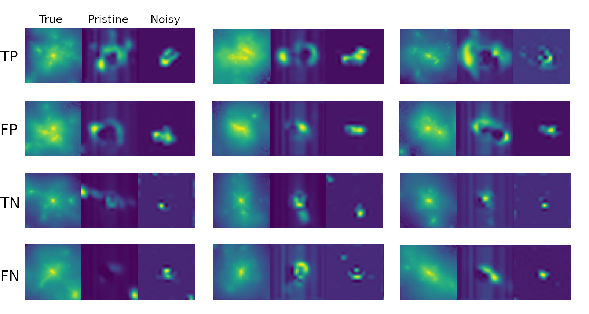

# DeepMerge

Code repository for the [paper](https://doi.org/10.1016/j.ascom.2020.100390) "DeepMerge: Classifying High-redshift Merging Galaxies with Deep Neural Networks", A. Ćiprijanovića, G.F. Snyder, B. Nord, J.E.G. Peek, Astronomy & Computing, Volume 32, July 2020, 100390


### Abstract

We investigate and demonstrate the use of convolutional neural networks (CNNs) for the task of distinguishing between merging and non-merging galaxies in simulated images, and for the first time at high redshifts (i.e.,  z=2).
We extract images of merging and non-merging galaxies from the Illustris-1 cosmological simulation and apply observational and experimental noise that mimics that from the Hubble Space Telescope; the data without noise form a pristine data set and that with noise form a noisy data set.
The classification accuracy of the CNN is 76% for pristine and 79% for noisy. 
The CNN outperforms a Random Forest classifier, which was shown to be superior to conventional one- or two-dimensional statistical methods (Concentration, Asymmetry, the Gini, M_20 statistics etc.), which are commonly used when classifying merging galaxies.
We also investigate the selection effects of the classifier with respect to merger state and star formation rate, finding no bias.
Finally, we extract saliency maps from the results to further assess and interrogate the fidelity of the classification model.

### Architecture

DeepMerge has 3 convolutional layers (with 3 pooling layers) and 3 dense layers, added after flattening. It also has dropout after each convolutional layer, as well as weight regularization in the first two dense layers.

### Prepare Datasets
Images used can be found at https://doi.org/10.17909/t9-vqk6-pc80. Pristine and noisy images used in the paper can be found in SB00_augmented.npy and SB25_augmented.npy, respectively (label files: SB00_augmented_y.npy and SB25_augmented_y.npy). Raw (large) and resized images are also available for those who would like to try their own image formating and augmentation. Images we use have 2 filters (they mimic those available onboard the Hubble Space Telescope). For use with more complex neural networks we also have 3-filter files available (SB00_augmented_3FILT.npy and SB25_augmented_3FILT.npy, and corresponding labels SB00_augmented_3FILT_y.npy and SB25_augmented_3FILT_y.npy)

### Training
Training is performed with early stopping (with validation loss being monitored). To run training and plot training and classification diagnostics use DeepMerge.ipynb and DeepMerge-noisy.ipynb files. 


### Galaxy properties
You can also use DeepMerge.ipynb and DeepMerge-noisy.ipynb files to plot information about galaxy morphology and physical properties, which is also available for our images - concentration, M20 and stellar mass (there are other parameters available to be extracted from the catalogue we use - illustris_morphs_rf.txt).

### Gradient-weighted Class Activation Maps (Grad-CAMs)
Grad-CAMs show which pixels of the image were the most important for the classification into a particular class. This is important as a sanity check when using neural networks, but it can also show how different architectures "look" at images differently when doing the same classification. It is also important if we want to track how additional noise or image resizing impacts decidion making of our neural network. For example, DeepMerge trained on pristine and noisy images looks at different regions of the same galaxy for the classification (see image below).


### Requirements
Code was developed using Python 3.7.4. The requirements.txt file should list all Python libraries that your notebooks depend on, and they can be installed using:
```
pip install -r requirements.txt
```


### Authors
- Aleksandra Ćiprijanović
- Brian Nord
- Gregory Snyder
- Joshua Peek

### References
If you use this code, please cite our paper:"Deep Merge: Classifying Merging Galaxies with Deep Neural Networks" A. Ciprijanovic, G. F. Snyder, B. Nord, J. E. G. Peek, 2020, Astron. Comput., 32, 100390

